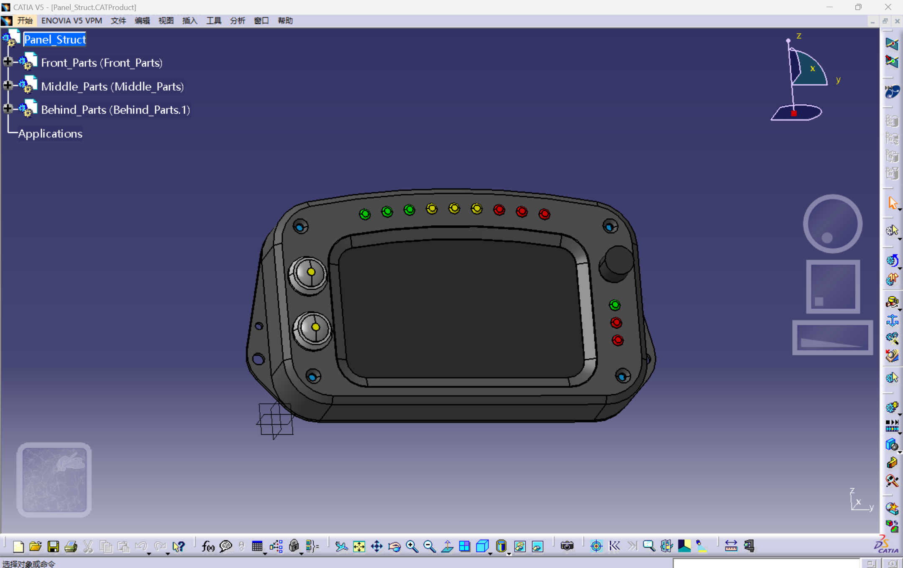
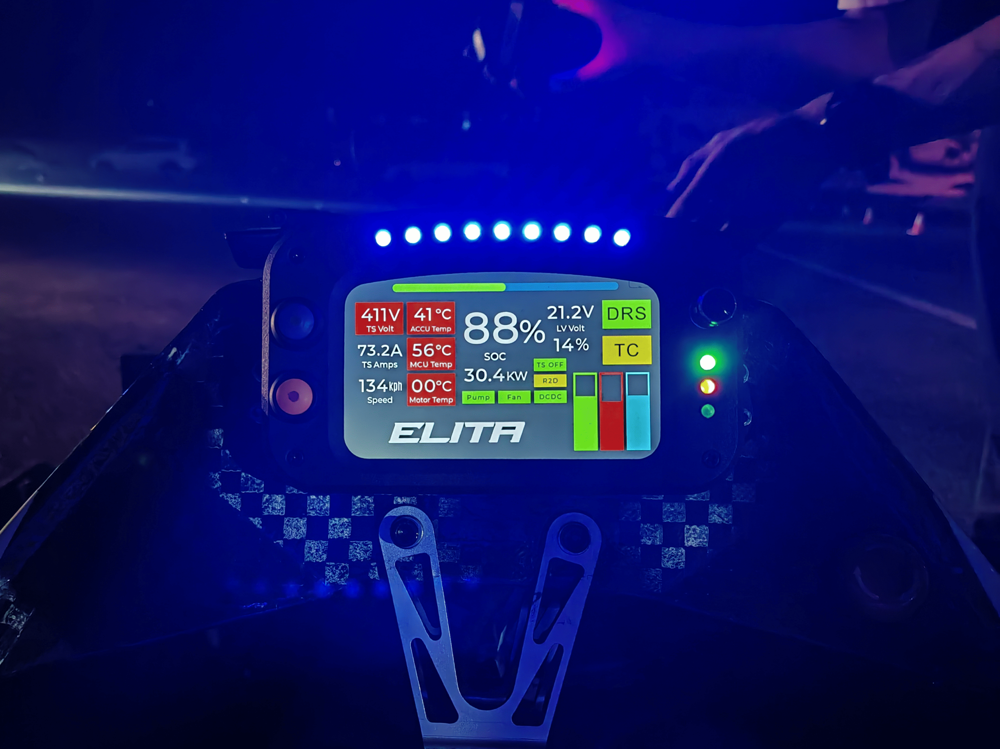

# 针对WUTE车队电动方程式赛车开发的多功能仪表 WUTE_Dashboard

本人负责设计开发的WUTE第一代自制仪表（该项目也是2023自创项目“针对电动方程式赛车开发的车身电子监控与人机交互系统”的人机交互部分），一款基于STM32H7B0VET6，采用5寸TFT高亮屏(800nit)，使用LVGL图形库绘制GUI界面并实时刷新赛车监测数据的多功能仪表，具体功能如下：

功能说明：
1. 实时采集整车跑动数据，并在屏幕上实时刷新显示
2. 具备屏幕亮度随环境光自动调节功能
3. 集成跑马灯功能
4. 支持与整车CAN通讯
5. 集成2.4G无线数传模块（ESP8266模块）
6. 集成激活按钮、待驶按钮以及TSOFF、BMS、IMD指示灯

# 设计说明

## 硬件说明

硬件设计方面，

PCB设计展示：

## 软件说明

开发平台：STM32H7B0VET6

开发环境：STM32cubeMX+Keil+VSCode

#### 软件架构

仪表软件采用裸机编程开发，软件整体可分为

GUI界面基于LVGL图形库开发

项目代码展示：

## 模型说明

## GUI设计说明

GUI设计界面：

# 测试

屏幕静态显示测试：

屏幕动态刷新测试：

# 上车

施工中...