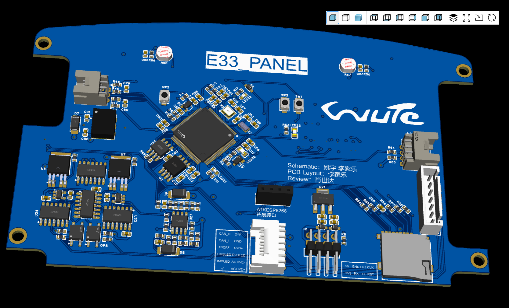
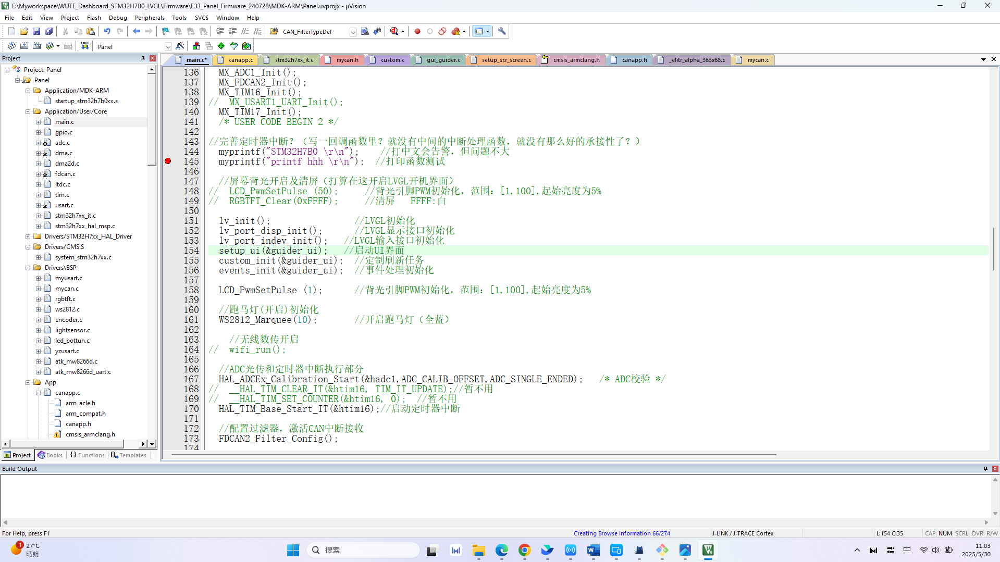
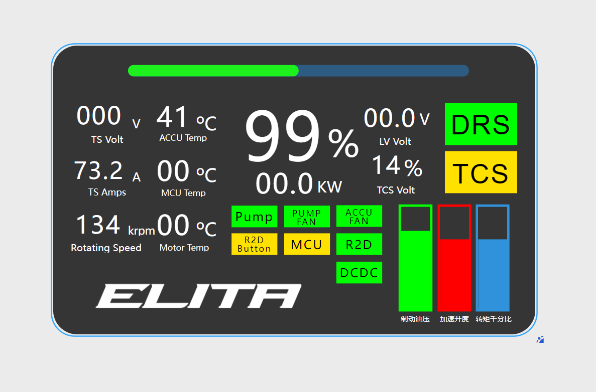
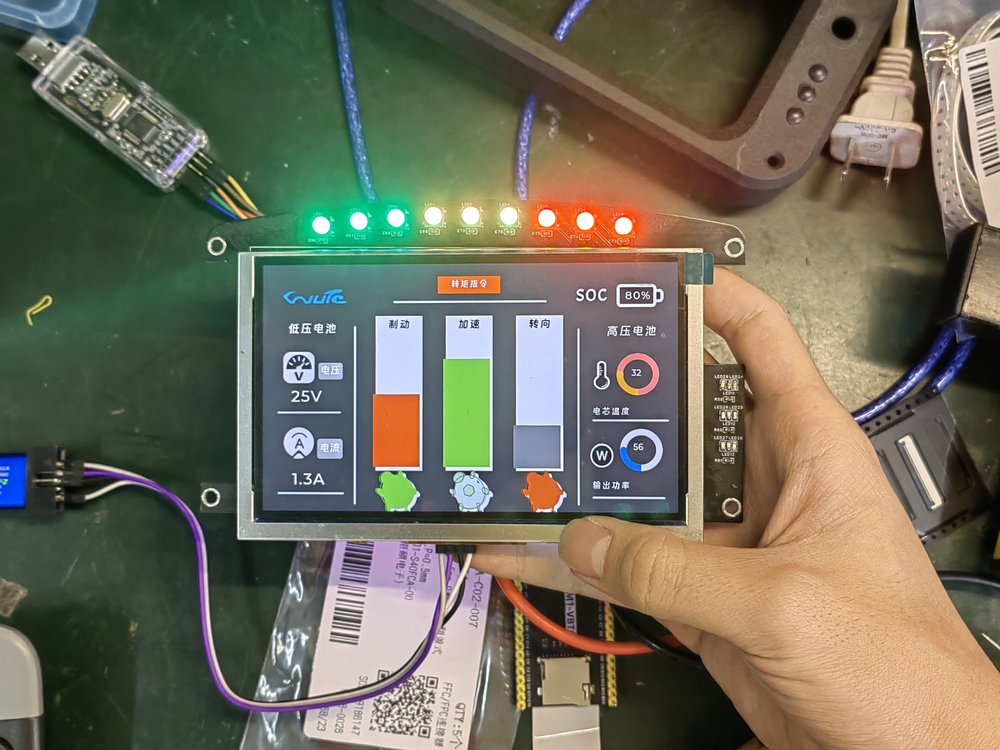

# 针对WUTE车队电动方程式赛车开发的多功能仪表 WUTE_Dashboard

本人参与的自创项目<针对电动方程式赛车开发的车身电子监控与人机交互系统>的仪表端部分，一款基于STM32H7B0VET6，采用5寸高亮屏，使用LVGL绘制GUI界面并实时刷新数据的多功能仪表，具体功能如下：

功能说明：
1. 集成跑马灯
2. 实时采集整车跑动数据，并在屏幕上实时刷新显示
3. 具备屏幕亮度随环境光自动调节功能
4. 支持与整车CAN通讯
5. 集成2.4G无线数传模块
6. 集成激活按钮、待驶按钮以及TSOFF、BMS、IMD指示灯

# 设计说明

## 硬件说明

PCB设计展示：

## 软件说明

WUTE_Dashboard嵌入式软件基于STM32cubeIDE+Keil开发，GUI基于LVGL图形库开发

项目代码展示：

## GUI设计说明

GUI设计界面：

# 测试

屏幕显示静态测试：

屏幕刷新动态测试：

施工中...